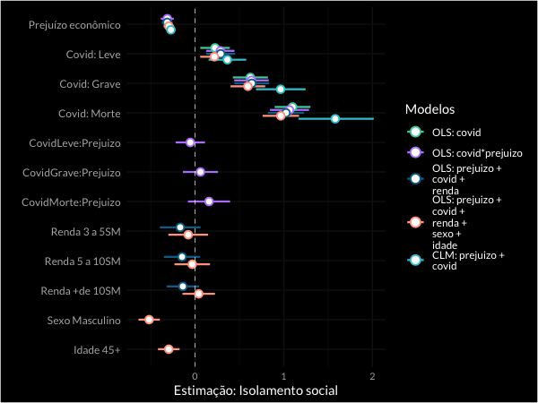

```{r setup, include=FALSE,warning=F,message=F}
knitr::opts_chunk$set(echo = FALSE,
                      fig.margin=TRUE,
                      warning = F,
                      message = F#,
                  #    fig.height=4,
                  #    fig.width=6.8,
                  #    fig.align = 'center'
                  )

lista.de.pacotes = c("tidyverse","haven","lubridate","janitor","readxl",
                     "stringr","repmis","pander",
                     #"srvyr","ggstatsplot",
                     "flextable","compareGroups",
                     "magrittr","ggridges","ggpubr","ggdark",
                     "hrbrthemes","viridis","extrafont",
                     "dabestr","patchwork") # escreva a lista de pacotes

novos.pacotes <- lista.de.pacotes[!(lista.de.pacotes %in%
                                      installed.packages()[,"Package"])]
if(length(novos.pacotes) > 0) {install.packages(novos.pacotes)}
lapply(lista.de.pacotes, require, character.only=T)
rm(lista.de.pacotes,novos.pacotes)
gc()

loadfonts()

# Rodando o namespace
load("env.RData")

tema_dens <-
  theme(plot.margin = ggplot2::margin(0, 0, 0, 0, "cm"),
      text = element_text(family = "Lato") )


paleta <- c( "#4ACFAC",
             "#BB86FC",
             "#087099",#"#7EBCED",
             "#FFA48E",
             "#36C7D0")

cores = paleta

fonte_t = "Lato"

```


# {.right}

<br>
<br>
“Quem é você?<br>
<amar>Eu sou a morte.</amar><br>
Você veio me buscar?<br> 
<amar>Eu tenho acompanhado você há muito tempo...</amar><br>
Eu sei.<br>
<amar>Você está preparado? </amar><br>
Meu corpo está, mas eu não estou.
Espere um instante.<br>
<amar>Todos vocês dizem isso, mas não há trégua.</amar>”<br>
<br>
<bold>O Sétimo Selo,<br> <yt>Ingmar Bergman</yt> (1956)</bold>

# Questões de interesse

Choque Exógeno: COVID-19 <br>
- <amar>Altera o eixo da polarização?</amar> (isolamento social)

<yt>Ideologia</yt>
<p class="center">
Bolsonaro > consequências econômicas <br>
vs.<br>
Governadores > riscos à saúde
</p>

<yt>Pertencimento de grupo</yt>
<p class="center">
In-group > contra o isolamento <br>
vs.<br>
Out-group > a favor do isolamento <br>
</p>

# Governando com o "povo": uma aproximação populista ao modelo de coalizão

- In-group vs. out-group

- Povo vs. elites (e as coalizões)

- Blame shifting como estratégia de comunicação populista

#	Metodologia

- Pesquisa de opinião, entre 28.mar e 04.abr. Distribuição: redes sociais. 

- n = 7.848 (8.168 pré limpeza)

(1) opinião sobre isolamento social; prejuízos financeiros para sua atividade; iii) as medidas de isolamento que haviam sido implementadas pelo governo; iv) se conheciam alguém infectado pela Covid-19; 

(2) quem acreditavam ser a autoridade responsável pelo controle da pandemia; 

(3) como avaliavam as ações de governadores e Presidente; 

(4) o grau de concordância com a política de isolamento e por quanto estariam dispostos a ficar isolados; 

(5) aspectos sócio demográficos.


# Novos eixos da polarização ideológica

- Consenso do Centro à Esquerda: <yt>a favor do isolamento e contra as ações do Presidente</yt>.

- A <amar>direita</amar>, porém, está <amar>dividida</amar>!


## Avaliação sobre o isolamento por ideologia {.center}

```{r}

plot_dens(df,ideologia_cat,favor_isol,paleta = cores,fonte = fonte_t,tema_base = ggdark::dark_theme_minimal())  +
  scale_x_continuous("",breaks = c(1,3,5),
                     labels=c("Totalmente\nContrário (1)",
                              "Indiferente (3)",
                              "Totalmente\nFavorável (5)")) +
  scale_y_discrete("",expand = expansion(mult = c(.05, .2))) +
  tema_dens
  

```


## Avaliação sobre o tempo de isolamento por ideologia {.center}

```{r}
plot_dens(df,ideologia_cat,time,paleta = cores,fonte = fonte_t,tema_base = ggdark::dark_theme_minimal())  +

scale_x_continuous(breaks = c(1,7),
                     labels=c("Nem mais\n um dia (1)","Pelo tempo \nnecessário (7)")) +
  scale_y_discrete("",expand = expansion(mult = c(.05, .2))) +
  tema_dens
```


## Avaliação sobre as ações do Presidente {.center}

```{r}

plot_dens(df,ideologia_cat,trabbolso,paleta = cores,fonte = fonte_t,tema_base = ggdark::dark_theme_minimal())  +

  scale_x_continuous("",breaks = c(1,3,5),
                     labels=c("Totalmente\nContrário (1)",
                              "Indiferente (3)",
                              "Totalmente\nFavorável (5)")) +
  scale_y_discrete("",expand = expansion(mult = c(.05, .2))) +
  tema_dens
  
```


## Avaliação sobre as ações dos Governadores {.center}

```{r}
plot_dens(df,ideologia_cat,trabgov,paleta = cores,fonte = fonte_t,tema_base = ggdark::dark_theme_minimal())  +

  scale_x_continuous("",breaks = c(1,3,5),
                     labels=c("Totalmente\nContrário (1)",
                              "Indiferente (3)",
                              "Totalmente\nFavorável (5)")) +
  scale_y_discrete("",expand = expansion(mult = c(.05, .2))) +
  tema_dens

```


## Isolamento é coisa de rico?

- Diferença entre <amar>preferência</amar> por isolamento e <yt>possibilidade</yt> de realizá-lo.

## Preferência pelo isolamento por faixas de renda

```{r}

plot_dens(drt.df,renda_cat,favor_isol,paleta = cores,fonte = fonte_t,tema_base = ggdark::dark_theme_minimal())  +

  scale_x_continuous("",breaks = c(1,3,5),
                     labels=c("Totalmente\nContrário (1)",
                              "Indiferente (3)",
                              "Totalmente\nFavorável (5)")) +
  scale_y_discrete("",expand = expansion(mult = c(.05, .2))) +
  tema_dens

```


## {.center}

<h1> O que explica esse comportamento? </h1>


# O espectro da morte 

- À medida que os indivíduos tomam conhecimento de <amar>vítimas fatais</amar> em seu convívio próximo, as coisas começam a mudar.

- Ficam mais sensíveis ao isolamento, estão dispostos a praticarem por mais tempo. 

- Avaliam pior o Presidente e melhor os Governadores.

## Avaliação sobre o isolamento {.center}

```{r}

plot_dens(drt.df,coron_cat,favor_isol,paleta = cores,fonte = fonte_t,tema_base = ggdark::dark_theme_minimal())  +

  scale_x_continuous("",breaks = c(1,3,5),
                     labels=c("Totalmente\nContrário (1)",
                              "Indiferente (3)",
                              "Totalmente\nFavorável (5)")) +
  scale_y_discrete("",expand = expansion(mult = c(.05, .2))) +
  tema_dens
```


## Avaliação sobre o tempo de isolamento {.center}

```{r}

plot_dens(drt.df,coron_cat,time,paleta = cores,fonte = fonte_t,tema_base = ggdark::dark_theme_minimal())  +

scale_x_continuous(breaks = c(1,7),
                     labels=c("Nem mais\n um dia (1)","Pelo tempo \nnecessário (7)")) +
  scale_y_discrete("",expand = expansion(mult = c(.05, .2))) +
  tema_dens
```


## Avaliação sobre as ações do Presidente {.center}

```{r}

plot_dens(drt.df,coron_cat,trabbolso,paleta = cores,fonte = fonte_t,tema_base = ggdark::dark_theme_minimal())  +

  scale_x_continuous("",breaks = c(1,3,5),
                     labels=c("Totalmente\nContrário (1)",
                              "Indiferente (3)",
                              "Totalmente\nFavorável (5)")) +
  scale_y_discrete("",expand = expansion(mult = c(.05, .2))) +
  tema_dens

```


## Avaliação sobre as ações dos Governadores {.center}

```{r}

plot_dens(drt.df,coron_cat,trabgov,paleta = cores,fonte = fonte_t,tema_base = ggdark::dark_theme_minimal())  +

  scale_x_continuous("",breaks = c(1,3,5),
                     labels=c("Totalmente\nContrário (1)",
                              "Indiferente (3)",
                              "Totalmente\nFavorável (5)")) +
  scale_y_discrete("",expand = expansion(mult = c(.05, .2))) +
  tema_dens

```

## Isolamento pode não ser coisa de rico, mas...

- Quem acredita que terá muito prejuízo é menos aderente ao isolamento.

- Renda não tem relevância, mas o <amar>prejuízo econômico esperado</amar>, sim.

- Diferença entre <amar>preferência</amar> por isolamento e <yt>possibilidade</yt> de realizá-lo.

## Preferência pelo isolamento por faixas de renda

```{r}

plot_dens(drt.df,renda_cat,favor_isol,paleta = cores,fonte = fonte_t,tema_base = ggdark::dark_theme_minimal())  +

  scale_x_continuous("",breaks = c(1,3,5),
                     labels=c("Totalmente\nContrário (1)",
                              "Indiferente (3)",
                              "Totalmente\nFavorável (5)")) +
  scale_y_discrete("",expand = expansion(mult = c(.05, .2))) +
  tema_dens

```


## Preferência pelo isolamento por prejuízo econômico {.center}

```{r}

plot_dens(drt.df,prejuizo,favor_isol,paleta = cores,fonte = fonte_t,tema_base = ggdark::dark_theme_minimal())  +

  scale_x_continuous("",breaks = c(1,3,5),
                     labels=c("Totalmente\nContrário (1)",
                              "Indiferente (3)",
                              "Totalmente\nFavorável (5)")) +
  scale_y_discrete("",expand = expansion(mult = c(.05, .2))) +
  tema_dens

```


# Uma escolha difícil?

Neste novo eixo de polarização, a <yt>exposição à morte importa</yt>. 

- Tanto no isolamento

- Quanto na posição em relação aos políticos

O medo da morte é tão grande que relativiza as outras dimensões

Como se relacionam opiniões sobre isolamento, prejuízo econômico e proximidade com pessoas afetadas pela doença?

## Concordância com Isolamento  {.center}
```{r}

drt.df %>%
  ggplot(aes(y=as.numeric(favor_isol),
                 x=prejuizo,
                 color=coron_cat,
              group=gruporisco
              )) +
  geom_point(position = position_jitter(width = .15), 
             size = 1,alpha=.3) + 
  geom_smooth(method="lm",aes(group=coron_cat,fill=coron_cat),
              lwd=1,alpha=0.2) +
  scale_color_manual(values = paleta) +
  scale_fill_manual(values = paleta) +
  scale_y_continuous(breaks = c(1,3,5),
                     labels=c("Discorda","Indiferente","Concorda"),
                     expand = expansion(0.05)) +
  scale_x_discrete(expand = expansion(0.05)) +
  labs(y="",x="",
       color="Conhecimento sobre pessoas infectadas",fill="") +
  guides(color=guide_legend(title.position = "top",nrow = 1),
         fill=F) +
  dark_theme_minimal() +
  theme(legend.position = "top",
        legend.text = element_text(size=12),
        legend.title = element_text(size=13,face="bold"),
        axis.title = element_text(size=10,face="bold",hjust = 1),
        axis.text = element_text(size=12),
        plot.title = element_text(size=11),
        axis.text.y = element_text(angle=90,hjust = .5),
        plot.background = element_rect(color= NA),
        panel.background = element_rect(color = NA),
        panel.border = element_blank(),
        text = element_text(family = "Lato"))

```

## Concordância com as ações do Presidente {.center}

```{r}
drt.df %>%
  ggplot(aes(y=as.numeric(trabbolso),
                 x=prejuizo,
                 color=coron_cat,
              group=gruporisco
              )) +
  geom_point(position = position_jitter(width = .15), 
             size = 1,alpha=.3) + 
  geom_smooth(method="lm",aes(group=coron_cat,fill=coron_cat),
              lwd=1,alpha=0.2) +
  scale_color_manual(values = paleta) +
  scale_fill_manual(values = paleta) +
  scale_y_continuous(breaks = c(1,3,5),
                     labels=c("Discorda","Indiferente","Concorda"),
                     expand = expansion(0.05)) +
  scale_x_discrete(expand = expansion(0.05)) +
  labs(y="",x="",
       color="Conhecimento sobre pessoas infectadas",fill="") +
  guides(color=guide_legend(title.position = "top",nrow = 1),
         fill=F) +
  dark_theme_minimal() +
  theme(legend.position = "top",
        legend.text = element_text(size=12),
        legend.title = element_text(size=13,face="bold"),
        axis.title = element_text(size=10,face="bold",hjust = 1),
        axis.text = element_text(size=12),
        plot.title = element_text(size=11),
        axis.text.y = element_text(angle=90,hjust = .5),
        plot.background = element_rect(color= NA),
        panel.background = element_rect(color = NA),
        panel.border = element_blank(),
        text = element_text(family = "Lato"))
```


## Estimações do apoio ao isolamento por prejuízo econômico e exposição aos efeitos da Covid-19 {.center}



```{r,eval=F}

library(jtools)

coefsnames = c(
               "Prejuízo econômico"="prejuizo",
               "Covid: Leve"="covidleve",
               "Covid: Grave"="covidgrave",
               "Covid: Morte"="covidmorte",
               "CovidLeve:Prejuizo"="covidleve:prejuizo",  
               "CovidGrave:Prejuizo"="covidgrave:prejuizo",
               "CovidMorte:Prejuizo"="covidmorte:prejuizo",
               "Renda 3 a 5SM"="rendaDe 3 a 5SM",
               "Renda 5 a 10SM"="rendaDe 5 a 10SM",
               "Renda +de 10SM"="rendaMais de 10SM",
               "Sexo Masculino"="sexoMasculino",
               "Idade 45+"="idade")


plot_summs(fit_a,fit_b,fit_c, fit_d,fit_clm, scale = TRUE, robust = T,
           point.shape = F,
           ci_level = 0.95,
           colors = cores,
           legend.title = "Modelos",
           coefs = coefsnames,
           
           model.names = c("OLS: covid",
                           "OLS: covid*prejuizo ",
                           "OLS: prejuizo +\ncovid +\nrenda ",
                           "OLS: prejuizo +\ncovid +\nrenda +\nsexo +\nidade ",
                           "CLM: prejuizo +\ncovid  ")) +
  labs(x="Estimação: Isolamento social",y="") +
    dark_theme_minimal() +
 theme(axis.text.y = element_text(family = fonte_t,size=9),
         axis.text.x = element_text(family = fonte_t,size=8),
        legend.title  = element_text(family = fonte_t),
       axis.title.x = element_text(family = fonte_t),
       text = element_text(family = fonte_t))


```


# Discussão 

1. Lideranças que sinalizam esforço para combater a pandemia podem extrair maiores benefícios políicos do que aquelas mais precupadas em evitar deterioração econômica.

<br>

2. A direita se dividiu, porém não é uma questão de renda, a divisão diminui à medida que o risco de morte se torna algo mais palpável.

<br>

<h2 class="center"><amar>Quem continua apoiando Bolsonaro?</amar></h2>


# {.center}

<h1> Próximas fases </h1>
